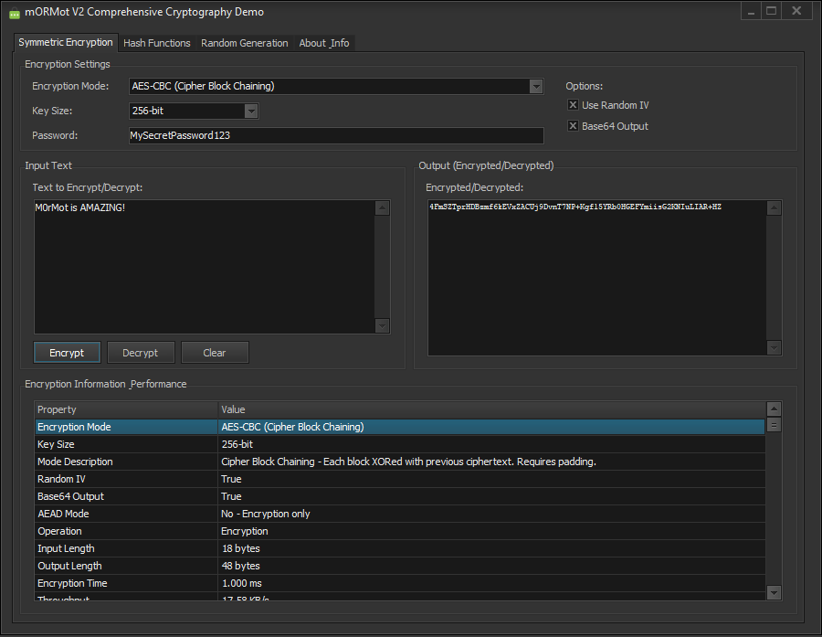

<h1>mORMot V2 Cryptography Demonstration Utility</h1>

This comprehensive Delphi application showcases the powerful cryptographic capabilities of the mORMot V2 framework. It provides a professional-grade interface for encryption/decryption, hashing, message authentication, key derivation, and secure random number generation.

<!-- Replace 'Preview.png' with the path to your actual image file -->

  

<h2>⚠️ Security Notice</h2>

This tool is designed for educational and demonstration purposes. While it implements industry-standard cryptographic algorithms, always review and adapt the code for production use. Pay special attention to key management, salt generation, and iteration counts for PBKDF2.

<h2>Features</h2>
<ul>
  <li><strong>AES Encryption Modes:</strong> Support for ECB, CBC, CFB, OFB, CTR, GCM, and mORMot custom AEAD modes (CFC, OFC, CTC).</li>
  <li><strong>Variable Key Sizes:</strong> 128-bit, 192-bit, and 256-bit AES encryption support.</li>
  <li><strong>Multiple Hash Algorithms:</strong> MD5, SHA-1, SHA-256, SHA-384, SHA-512, SHA-3-256, and SHA-3-512.</li>
  <li><strong>HMAC Authentication:</strong> HMAC-SHA256 for message authentication and integrity verification.</li>
  <li><strong>PBKDF2 Key Derivation:</strong> Password-based key derivation with configurable iterations.</li>
  <li><strong>Secure Random Generation:</strong> Cryptographically secure random number generation using TAesPrng.</li>
  <li><strong>Flexible Output Encoding:</strong> Base64 or Hexadecimal output formats.</li>
  <li><strong>Performance Metrics:</strong> Real-time encryption/decryption speed and throughput measurements.</li>
  <li><strong>Professional Documentation:</strong> Extensively commented code with security best practices.</li>
</ul>
## Installation
1. **Install mORMot V2 Framework:**
   - Download the latest mORMot V2 from [GitHub](https://github.com/synopse/mORMot2).
   - Extract the framework to your desired location.
   - Update the Library Path:
     - Go to **Tools -> Options...** and select **Library Path** for Win32/Win64.
     - Add the path to the mORMot2 `src` directory and its subdirectories:
       - `[mORMot2_Path]\src\core`
       - `[mORMot2_Path]\src\crypt`
       - `[mORMot2_Path]\src\net`
       - `[mORMot2_Path]\src\db`
2. **Open Delphi Project:** Open the `.dpr` file in the Delphi IDE.
3. **Compile:** Build the project to generate the executable.
4. **Run:** Execute the utility to start exploring cryptographic functions.
<h2>Usage</h2>
<h3>Encryption/Decryption</h3>
<ol>
  <li><strong>Select Mode:</strong> Choose from various AES encryption modes (CBC recommended for general use).</li>
  <li><strong>Set Key Size:</strong> Select 128, 192, or 256-bit encryption (256-bit recommended).</li>
  <li><strong>Enter Password:</strong> Provide a strong password for key derivation.</li>
  <li><strong>Configure Options:</strong> Enable random IV and choose output encoding.</li>
  <li><strong>Encrypt/Decrypt:</strong> Enter text and perform encryption or decryption operations.</li>
</ol>
<h3>Hash Functions</h3>
<ol>
  <li><strong>Select Algorithm:</strong> Choose from MD5, SHA variants, or SHA-3 (SHA-256 recommended).</li>
  <li><strong>Enter Text:</strong> Input the text to be hashed.</li>
  <li><strong>Calculate:</strong> Generate the cryptographic hash.</li>
</ol>
<h3>HMAC Authentication</h3>
<ol>
  <li><strong>Set Key:</strong> Enter a secret key for HMAC calculation.</li>
  <li><strong>Enter Message:</strong> Input the message to authenticate.</li>
  <li><strong>Generate HMAC:</strong> Calculate HMAC-SHA256 for verification.</li>
</ol>
<h3>Key Derivation (PBKDF2)</h3>
<ol>
  <li><strong>Enter Password:</strong> Provide the source password.</li>
  <li><strong>Set Salt:</strong> Enter cryptographic salt (use random salt in production).</li>
  <li><strong>Configure Iterations:</strong> Set iteration count (minimum 10,000 recommended).</li>
  <li><strong>Derive Key:</strong> Generate the strengthened key.</li>
</ol>
<h3>Random Generation</h3>
<ol>
  <li><strong>Specify Length:</strong> Enter desired number of random bytes (1-1024).</li>
  <li><strong>Generate:</strong> Create cryptographically secure random data.</li>
</ol>
<h2>Supported Algorithms</h2>
<h3>Encryption Modes</h3>
<ul>
  <li><strong>AES-ECB:</strong> Electronic Codebook (⚠️ NOT RECOMMENDED for production)</li>
  <li><strong>AES-CBC:</strong> Cipher Block Chaining (widely supported)</li>
  <li><strong>AES-CFB:</strong> Cipher Feedback (stream mode)</li>
  <li><strong>AES-OFB:</strong> Output Feedback (stream mode)</li>
  <li><strong>AES-CTR:</strong> Counter Mode (fast, parallelizable)</li>
  <li><strong>AES-GCM:</strong> Galois/Counter Mode (AEAD - authenticated encryption)</li>
  <li><strong>AES-CFC:</strong> mORMot CFB + CRC32C (custom AEAD)</li>
  <li><strong>AES-OFC:</strong> mORMot OFB + CRC32C (custom AEAD)</li>
  <li><strong>AES-CTC:</strong> mORMot CTR + CRC32C (custom AEAD)</li>
</ul>
<h3>Hash Functions</h3>
<ul>
  <li><strong>MD5:</strong> 128-bit (⚠️ cryptographically broken)</li>
  <li><strong>SHA-1:</strong> 160-bit (⚠️ deprecated for security)</li>
  <li><strong>SHA-256:</strong> 256-bit (✅ recommended)</li>
  <li><strong>SHA-384:</strong> 384-bit (high security)</li>
  <li><strong>SHA-512:</strong> 512-bit (high security)</li>
  <li><strong>SHA-3-256:</strong> 256-bit (latest standard)</li>
  <li><strong>SHA-3-512:</strong> 512-bit (latest standard, high security)</li>
</ul>
<h2>Security Best Practices</h2>
<ul>
  <li><strong>Use Strong Passwords:</strong> Always use complex, unique passwords for encryption.</li>
  <li><strong>Random IV/Nonce:</strong> Always enable random IV for encryption operations.</li>
  <li><strong>Unique Salts:</strong> Use a unique random salt for each PBKDF2 operation in production.</li>
  <li><strong>High Iteration Counts:</strong> Use at least 10,000 iterations for PBKDF2 (adjust based on security requirements).</li>
  <li><strong>AEAD Modes:</strong> Prefer authenticated encryption modes (GCM, CFC, OFC, CTC) when possible.</li>
  <li><strong>Avoid ECB:</strong> Never use ECB mode for encrypting multiple blocks of data.</li>
  <li><strong>Key Management:</strong> Implement proper key storage and lifecycle management in production.</li>
</ul>
<h2>Technical Requirements</h2>
<ul>
  <li><strong>Delphi:</strong> RAD Studio 10.3 Rio or later</li>
  <li><strong>Framework:</strong> mORMot V2 (latest version recommended)</li>
  <li><strong>Platform:</strong> Windows 32-bit/64-bit</li>
  <li><strong>Dependencies:</strong> VCL Components (Forms, Controls, etc.)</li>
</ul>
<h2>Contributing</h2>

Contributions are welcome! If you have improvements, security enhancements, or bug fixes, please fork the repository and submit a pull request. All cryptographic implementations should follow established security standards and best practices.

<h2>License</h2>

This project is provided as is without warranty, use at your own risk! Ensure proper security review before using in production environments.

## 📧 Contact
Discord: BitmasterXor

Made with ❤️ by: BitmasterXor and Friends, using Delphi RAD Studio

